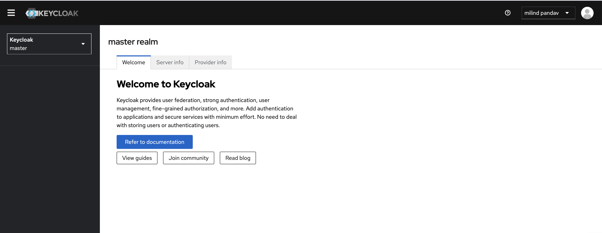

# Keycloak Quick Testing Setup

Deploy KeyCloak (Open Source Identity and Access Management) Server to your local K8S cluster 

## Prerequisites
- Local K8S cluster (minikube, docker-desktop, etc)
- nginx Ingress controller
- Postgre SQl server (you can deploy one from here)
  
## Create Secret 
Use certificates and key available in /certs folder

    kubectl create secret -n keycloak tls tls-secret --key tls_key.key --cert tls.crt

## Deploy it to K8S

    kubectl apply -f deployment.yaml

Keycloak is available on: https://keyclock.localhost.dataplanes.pro/

## Creating temp user for first login

By default keycloak does not have any user created. You can login to container and run the command,

    ./kc.sh bootstrap-admin user --bootstrap-admin-username <userName> --bootstrap-admin-password <userPassword>

This is a temporary user; you can use it for first login and then delete it once you have configured your nornal user.

Now, you have working KeyCloak setup to play with.

Cheers!!